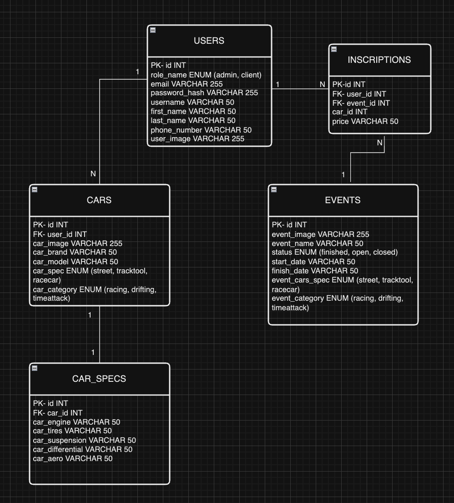

# GRIP BALANCE API REST

<details>
  <summary>Contenido 📝</summary>
  <ol>
    <li><a href="#objetivo">Objetivo</a></li>
    <li><a href="#sobre-el-proyecto">Sobre el proyecto</a></li>
    <li><a href="#stack">Stack</a></li>
    <li><a href="#diagrama-bd">Diagrama</a></li>
    <li><a href="#instalación-en-local">Instalación</a></li>
    <li><a href="#endpoints">Endpoints</a></li>
    <li><a href="#futuras-funcionalidades">Futuras funcionalidades</a></li>
    <li><a href="#contribuciones">Contribuciones</a></li>
    <li><a href="#licencia">Licencia</a></li>
    <li><a href="#webgrafia">Webgrafia</a></li>
    <li><a href="#desarrollo">Desarrollo</a></li>
    <li><a href="#agradecimientos">Agradecimientos</a></li>
    <li><a href="#contacto">Contacto</a></li>
  </ol>
</details>

## Objetivo

Este proyecto constituye una API funcional en TypeORM conectada a una base de datos SQL y al frontal que estoy desarrollando en React https://github.com/HSoriano99/FrontendGripBalance

## Sobre el proyecto

Consiste en una aplicación web para eventos de motorsport, que nos permitirá registrarnos, disponer de un perfil de usuario donde tenemos un garaje virtual donde añadimos nuestros coches, incluir caracteristicas tecnicas del vehiculo y editarlas para posteriormente inscribirse en diferentes eventos con nuestros coches en funcion de su compatibilidad con el evento. Como futuras funcionalidades podremos ver los inscritos en eventos pasados, ver sus coches y comparar sus caracteristicas o una vista como administrador con permisos únicos sobre usuarios y eventos.

## Stack

Tecnologías utilizadas:

- SQL/MySQL
- EXPRESS
- DOCKER
- NODE.JS
- TYPESCRIPT
- TYPEORM

## Diagrama BD



## Instalación en local

1. Clonar el repositorio
2. `$ npm install`
3. Conectamos nuestro repositorio con la base de datos
4. `$ Ejecutamos las migraciones`
5. `$ Ejecutamos los seeders`
6. `$ npm run dev`
7. ...

## Endpoints

<details>
<summary>Endpoints</summary>

- USER

- REGISTER USER

          POST http://localhost:3000/api/users/registerUser

    body:

    ```js
        {
            "username": "Aleeex",
            "email": "alex@email.com",
            "password": "12345"

        }
    ```

- LOGIN

          POST http://localhost:3000/api/users/login

    body:

    ```js
        {
            "email": "alex@email.com",
            "password": "12345"
        }
    ```

- UPDATE PASSWORD

          PATCH http://localhost:3000/api/users/update-password/:id

    body:

    ```js
        {
            "current_password": "12345",
            "new_password": "password"
        }
    ```

- UPDATE USER

          PATCH http://localhost:3000/api/users/update-user/:id

    body:

    ```js
        {
            "username": "Alexito76"
        }
    ```

- GET COMPLETE PROFILE (NUESTRO UNICAMENTE, DEBEREMOS ESTAR LOGEADOS)

          GET http://localhost:3000/api/users/get-complete-user/:id?pageCar=2&limitCar=1&pageInsc=2&limitInsc=1

    - Insertamos el ID de nuestro user para visualizar los datos del perfil, así como las querys de paginación para coches e inscripciones del usuario.

- GET USER CARS PAGINATED (NUESTRO UNICAMENTE, DEBEREMOS ESTAR LOGEADOS)

          GET http://localhost:3000/api/cars/get-user-car/:id?pageCar=2&limitCar=1&pageInsc=2&limitInsc=1

    - Insertamos el ID de nuestro user así como las querys de paginación para los coches.

- CARS

-  CAR REGISTER (UNICAMENTE PUEDE EL CLIENTE LOGUEADO)

          POST http://localhost:3000/api/cars/register-user-car/:id

      body:

    ```js
        {
            "car_brand": "nissan",
            "car_model": "silvia s15",
            "car_image": "https://i.pinimg.com/736x/f6/fc/29/f6fc298f79754b8a7a00d1305f7d439d.jpg",
            "car_spec": "street",
            "car_category": "drifting"
        }
    ```

- CAR WITH CARSPECS REGISTER (UNICAMENTE PUEDE EL CLIENTE LOGUEADO)

           PATCH http://localhost:3000/api/cars/register-user-car-carspec/:id

        body:

    ```js
        {
            "car_brand": "nissan",
            "car_model": "silvia s15",
            "car_image": "https://i.pinimg.com/736x/f6/fc/29/f6fc298f79754b8a7a00d1305f7d439d.jpg",
            "car_spec": "street",
            "car_category": "drifting",
            "car_aero": "c-west",
            "car_engine": "sr20det",
            "car_suspension": "stance",
            "car_tires": "kr20a",
            "car_differential": "2way lsd"
        }   

- CARSPECS REGISTER (UNICAMENTE PUEDE EL CLIENTE LOGUEADO)

           PATCH http://localhost:3000/api/carspec/register-carSpec-car/:id

        body:

    ```js
        {
            "car_aero": "c-west",
            "car_engine": "sr20det",
            "car_suspension": "stance",
            "car_tires": "kr20a",
            "car_differential": "2way lsd"
        }   

- UPDATE CARSPECS (UNICAMENTE PUEDE EL CLIENTE LOGUEADO)

          PATCH http://localhost:3000/api/carspec/update-carSpec-car/:id

    body:

    ```js
        {
            "car_tires": "Pergea"
        }
    ```
          


</details>

## Futuras funcionalidades

[ ] INCLUIR CAMPO USER_IMAGE EN LA MIGRACION/MODELO DE USER PARA PODER GESTIONAR EL CAMBIO DE IMAGEN DE PERFIL DEL USUARIO.
[ ] ...
[ ] ...

## Contribuciones

Las sugerencias y aportaciones son siempre bienvenidas.

Puedes hacerlo de dos maneras:

1. Abriendo una issue
2. Crea un fork del repositorio
   - Crea una nueva rama
     ```
     $ git checkout -b feature/nombreUsuario-mejora
     ```
   - Haz un commit con tus cambios
     ```
     $ git commit -m 'feat: mejora X cosa'
     ```
   - Haz push a la rama
     ```
     $ git push origin feature/nombreUsuario-mejora
     ```
   - Abre una solicitud de Pull Request

## Licencia

Este proyecto se encuentra bajo licencia de "Hector"

## Webgrafia:

Para conseguir mi objetivo he recopilado información de:

- Documentacion propia de TypeOrm
- ...

## Desarrollo:

```js
const developer = "Hector";

console.log("Desarrollado por: " + developer);
```

## Agradecimientos:

Agradezco a mis compañeros el tiempo dedicado a este proyecto:

- **Erika**

- **Gabriel**

- **Reynaldo**


## Contacto

<a href = "hsoriano9986@gmail.com"></a>
